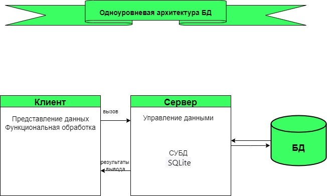
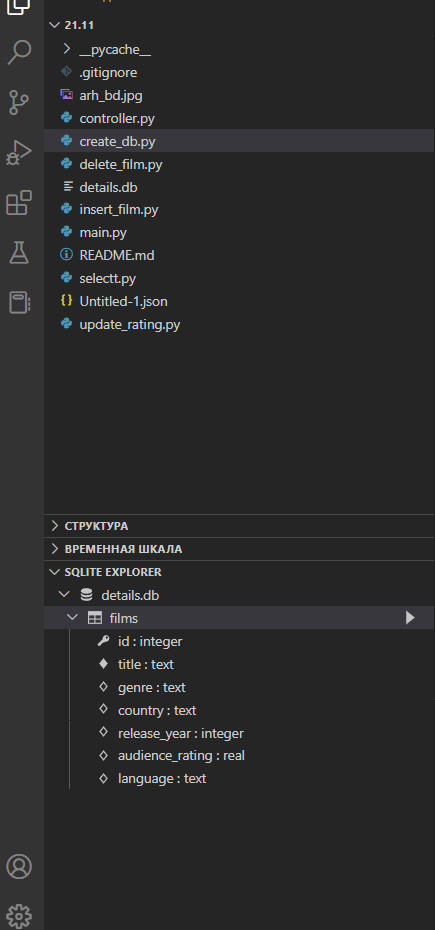
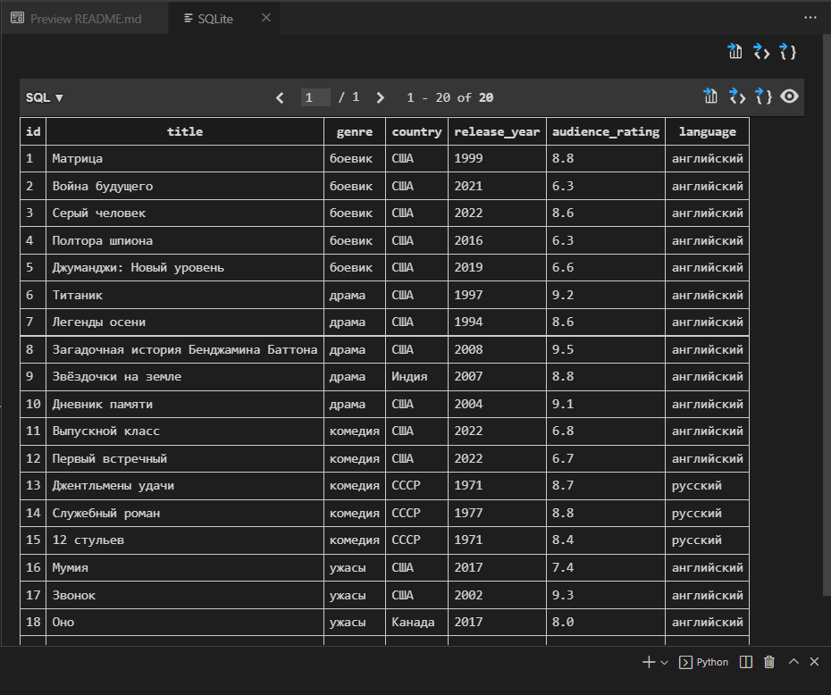

# Фильмотека

Мною разработана простейшая одноуровневая архитектура базы данных на примере фильмотеки.

- Есть возможность просматривать всю фильмотеку, выбирать по жанру, по названию фильма, по языку производства;
- Можно удалить данные из фильмотеки по названию фильма;
- Есть вариант добавить фильм в картотеку;
- Можно обновить рейтинг фильма.

## Архитектура


### Описание

Мною использована SQLite — компактная встраиваемая СУБД. SQLite не является отдельно работающим процессом, с которым взаимодействует программа, а представляет собой библиотеку, с которой программа компонуется. Таким образом, в качестве протокола обмена используются вызовы функций (API) библиотеки SQLite. SQLite хранит всю базу данных (таблицы) в единственном стандартном файле на том компьютере, на котором исполняется программа.

Для работы с SQLite я установила `Extension: SQLite` и 
```python
import sqlite3
```

Создала БД
```python
db = sqlite3.connect("details.db")
cursor=db.cursor()

 cursor.execute(""" CREATE TABLE IF NOT EXISTS films(id integer PRIMARY KEY AUTOINCREMENT, title text NOT NULL, genre text, country text, 
 release_year integer, audience_rating real, language text);""")
 cursor.execute("INSERT INTO films(title, genre, country, release_year, audience_rating, language) VALUES(?,?,?,?,?,?)", ("Дневник памяти", "драма","США", 2004, 9.1, "английский"))
 db.commit()
```




Основная логика работы: 

    CRUD — акроним, обозначающий четыре базовые функции, используемые при работе с базами данных: создание (англ. create), чтение (read), модификация (update), удаление (delete).

Немного примеров из программы:

```python
    variable = str.capitalize(input('Введите название фильма'))
    cursor.execute("SELECT * from films   WHERE title = '"+  variable +"'")
    result = cursor.fetchone()
    #
    cursor.execute("INSERT INTO films(title, genre, country, release_year, audience_rating, language) VALUES(?,?,?,?,?,?)", (title, genre, country, release_year, audience_rating, language))
    #
    cursor.execute("DELETE from films WHERE title= '"+ variable+"'")
    db.commit()
    #
    new = input('Введите новый рейтинг: ')
    cursor.execute("UPDATE films SET audience_rating = '"+ new +"' WHERE title= '"+ variable +"'")
```

Также есть возможность хранения информации в файле формата .json (`Untitled-1.json`)

Точка входа в программу модуль `main.py`